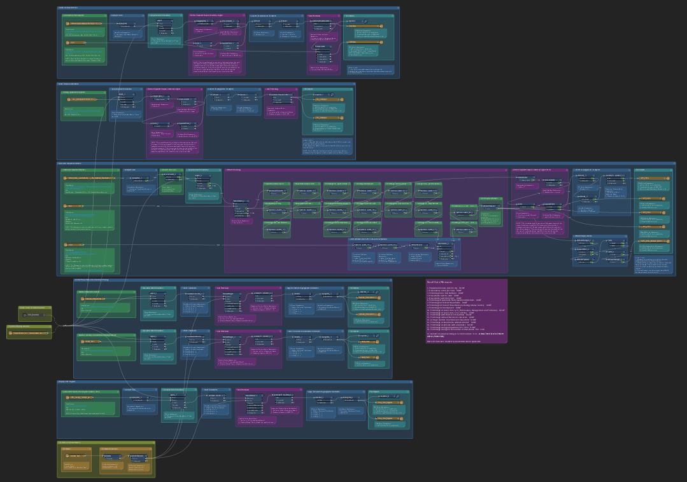

# Building City Dashboards 3D Planning Tool - Workspace for Automating Data Preparation in FME

This repository includes FME workspaces for automating the preparation and processing of open data on planning information and Small Area Population Statistics in Dublin for use in the Building City Dashboards 3D Planning Tool.

## BCD 3D Model Layers

## Geolocate 3D Model
This workspace takes a 3D model that has been moved to world origin (0,0,0) in a 3D modelling package for editing or visualisation, and applies an known offset in order to re-locate it in its correct geographic position.

Assumptions:
1. The 3D model is positioned close to the origin (0,0,0) in the the local coordinate space of a 3D modelling package. 
2. A file has been provided describing a spatial offset (x,y,z) that has been used to move the model from world coordinates to the local coordinate system of the 3D modelling package.
3. The world coordinate system is known.

## Set Model Origin By Geolocation 

## Acknowledgements
On behalf of the Building City Dashboards project we gratefully acknowledge funding from **Science Foundation Ireland** under the Investigator’s Award Program. **Award number: 15/IA/3090**
